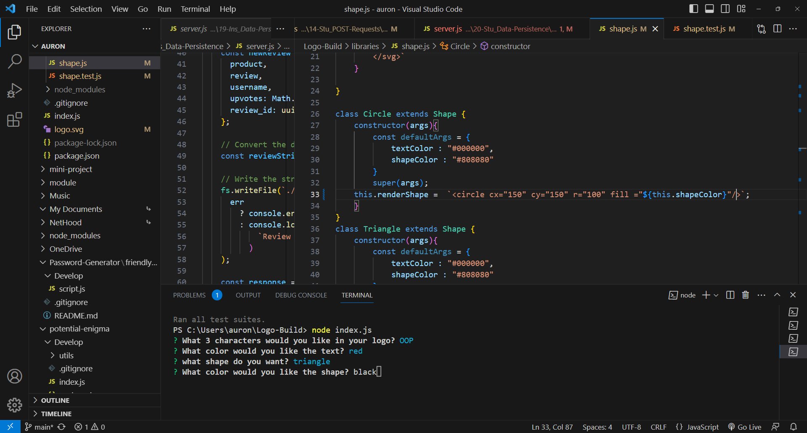
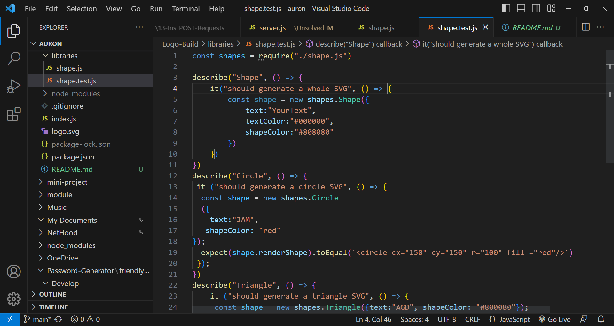
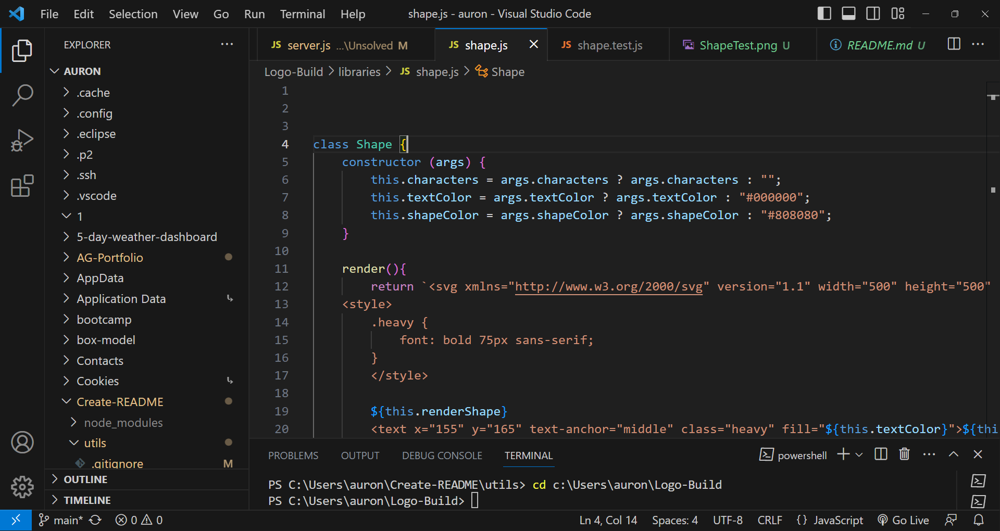

  

# Logo-Build

## Description
App to help build a logo in SVG using node.js

## Table of Contents
- [Installation](#Installation)
- [Usage](#Usage)
- [Credits](#Credits)
- [License](#License)
- [Contributors](#Contributing)
- [Tests](#Tests)
- [Questions](#Questions)

## Installation
Please install node.js 
  
## Usage 
This app will allow the user to answer simple questions to create a simple logo  quickly.

## Credits
I did receive some help from Josh from the class.

## License 
For more info, please visit: [License Link](https://opensource.org/licenses/MIT)

## Contributing
Feel free to add wonderful features

## Tests 
There are jest tests that are included, just use npm test to run them

## Questions 
If you have any questions you can find me at [SilvAG6271](https://github.com/SilvAG6271) and <a href="mailto:auron7985@gmail.com">auron7985@gmail.com</a>.
